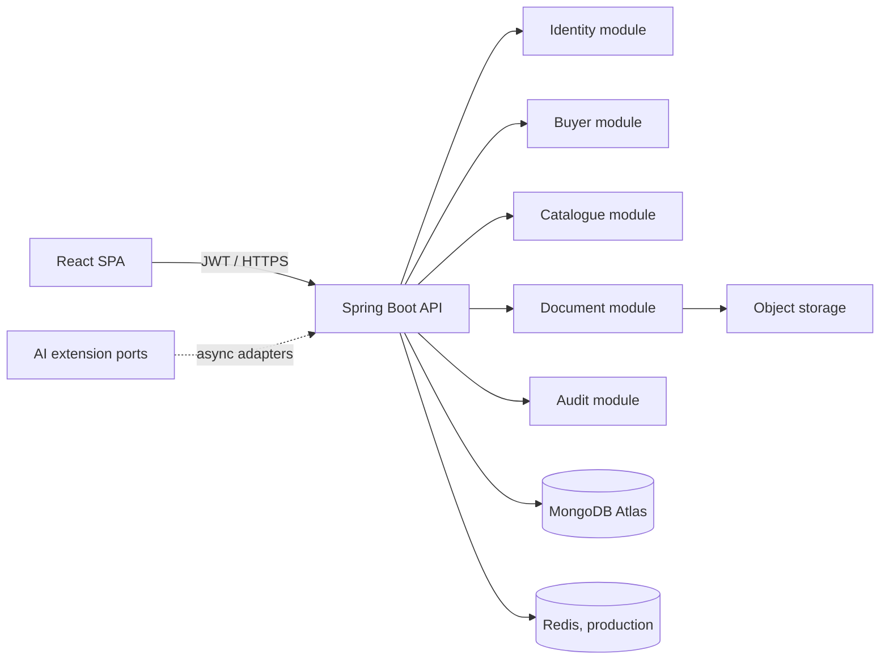

# 2. Complete Architecture

The backend uses domain-oriented modules with API DTOs at the boundary. Controllers never expose persistence objects. State-changing actions emit audit events. File scanning and future AI jobs run asynchronously through a queue adapter. Deploy the SPA through a CDN; deploy stateless API replicas behind a load balancer.

### AI extension ports
`DocumentIntelligencePort`, `CatalogueExtractionPort`, `RecommendationPort`, `LeadScoringPort`, `SemanticSearchPort`, and `AssistantPort` are contracts only. Adapters must return provenance, confidence, and require human approval before changing compliance status.
